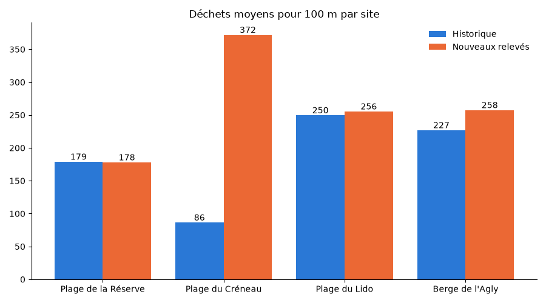

# Validation des relevés de déchets

Ce script compare de **nouveaux relevés de déchets**, saisis par des classes et pas encore vérifiés, à un **historique de relevés déjà validés**. Il signale les relevés incomplets ou qui s'écartent trop de l'historique de leur site, calcule l'écart entre les moyennes et génère un graphique par site.

> Les données fournies sont **fictives**.

## Démarrage rapide

```bash
make
```

C'est tout. La première fois, `make` crée un environnement virtuel Python (`.venv/`), installe les dépendances, puis lance la validation.

### Prérequis

- **Python 3.9 ou plus récent**, avec le module `venv`. Sur Ubuntu ou Debian, si besoin : `sudo apt install python3-venv`.
- **make**.

Le Makefile fonctionne sous Linux et macOS. Sous Windows, il faut passer par WSL.

## Commandes

| Commande | Effet |
|---|---|
| `make` | Installe si besoin, puis lance la validation |
| `make install` | Crée `.venv/` et installe les dépendances, sans lancer |
| `make run` | Lance la validation (installe si besoin) |
| `make clean` | Supprime `__pycache__/` et `courbe.png` |
| `make fclean` | `clean` + supprime l'environnement `.venv/` |
| `make re` | Tout supprimer et tout refaire |

Les dépendances ne sont réinstallées que si `requirements.txt` change.

## Exemple de résultat

### Dans le terminal

```
=== Validation des nouveaux relevés ===

Fiabilité des relevés :
  N01  100 %  fiable
  N02  100 %  fiable
  N03  100 %  fiable
  N04   10 %  douteux
        - Plastiques (312) supérieurs au total des déchets (226) (-50)
        - Plastiques : +94 % vs historique du site (-40)
  N05   20 %  douteux
        - Déchets : +987 % vs historique du site (-40)
        - Plastiques : +1033 % vs historique du site (-40)
  N06  100 %  fiable
  N07   40 %  douteux
        - Déchets manquants (-60)
  N08  100 %  fiable
  N09  100 %  fiable

  Fiabilité moyenne : 74 % (3 relevé(s) sur 9 avec au moins un problème)

Moyennes pour 100 m :
                Historique    Nouveaux     Écart
  Déchets            185.6       290.0    +56.3%
  Plastiques         131.6       221.2    +68.2%

Graphique enregistré dans courbe.png
```

Comment le lire :

- **Fiabilité** : chaque relevé a un score sur 100. Sous chaque relevé, on voit les problèmes trouvés et les points retirés pour chacun.
  - `N04` (10 %) : il y a plus de plastiques que de déchets au total, ce qui est impossible.
  - `N05` (20 %) : 940 déchets à la Plage du Créneau, contre environ 86 d'habitude. C'est très probablement une erreur de saisie.
  - `N07` (40 %) : il n'a pas de valeur de déchets.
- **Moyennes** : c'est la moyenne tous sites confondus. Elle augmente de +56 % surtout à cause de `N05`, qui reste compté parce qu'un relevé « à contrôler » n'est pas forcément faux.

### Le graphique (`courbe.png`)



Pour chaque site, la barre bleue montre la moyenne historique et la barre orange la moyenne des nouveaux relevés. Trois sites sont stables. La **Plage du Créneau** passe de 86 à 372, ce qui confirme l'anomalie de `N05`.

> L'image ci-dessus est une copie enregistrée dans `docs/`. Le `courbe.png` généré à la racine est supprimé par `make clean`.

## Ce que fait le script

1. **Chargement des données.** Il lit les deux fichiers JSON et transforme chaque site et chaque relevé en objet Python.
2. **Vérification des sites** avec [Pydantic](https://docs.pydantic.dev/). Les types sont contrôlés, la latitude doit être comprise entre -90 et 90 et la longitude entre -180 et 180. Si un site est invalide, l'erreur est affichée et le script s'arrête.
3. **Score de fiabilité.** Chaque nouveau relevé part de **100 %** et perd des points pour chaque problème, selon sa gravité :

   | Problème | Points retirés |
   |---|---|
   | Valeur de déchets ou de plastiques manquante (par valeur) | −60 |
   | Plus de plastiques que de déchets au total | −50 |
   | Écart de plus de 50 % avec la moyenne historique du site (déchets ou plastiques, chacun compté à part) | −40 |
   | Écart de 30 à 50 % avec la moyenne historique du site | −10 |

   Le score ne descend pas sous 0. Il est ensuite traduit en appréciation : **fiable** à partir de 80 %, **à vérifier** de 50 à 79 %, **douteux** en dessous de 50 %. Toutes ces valeurs sont des constantes en haut de `Validation.py` (`PENALTY_*`, `MIN_DIFF_PCT`, `MAX_DIFF_PCT`, `RELIABLE_SCORE`, `DOUBTFUL_SCORE`). On peut donc régler la sévérité sans toucher au reste du code.

   Les écarts sont comparés à l'historique **du même site**, car chaque site a son propre niveau normal : environ 86 déchets à la Plage du Créneau, environ 250 à la Plage du Lido.
4. **Calcul des moyennes.** Il calcule la moyenne des déchets et des plastiques pour 100 m, pour l'historique d'un côté et les nouveaux relevés de l'autre, puis l'**écart en %** :
   `(nouvelle moyenne − moyenne historique) / moyenne historique × 100`.
   Les relevés avec une valeur manquante sont exclus des moyennes. Les autres y restent, même avec un score bas.
5. **Graphique et rapport.** Il génère `courbe.png` et affiche le rapport dans le terminal.

## Les données

### `valid_history.json`, la référence déjà validée

```json
{
  "description": "...",
  "sites": [
    { "site_id": "S1", "nom": "Plage de la Réserve", "commune": "Argelès-sur-Mer",
      "milieu": "plage", "latitude": 42.579, "longitude": 3.046 }
  ],
  "releves": [
    { "releve_id": "H01", "site_id": "S1", "date": "2021-10-05",
      "dechets_100m": 172, "plastiques_100m": 121, "type_dominant": "usage_unique" }
  ]
}
```

### `new_readings.json`, les relevés à vérifier

Même format pour `releves`, avec en plus `latitude` et `longitude` pour chaque relevé. Ce fichier ne contient pas de liste `sites`.

### Les sites

| Code | Nom | Commune | Milieu |
|---|---|---|---|
| S1 | Plage de la Réserve | Argelès-sur-Mer | plage |
| S2 | Plage du Créneau | Narbonne | plage |
| S3 | Plage du Lido | Sète | plage |
| S4 | Berge de l'Agly | Rivesaltes | berge |

Chaque relevé est rattaché à un site par son `site_id`.

## Structure du projet

```
project_PAL/
├── Validation.py          # le script
├── valid_history.json     # sites + relevés validés
├── new_readings.json      # nouveaux relevés à vérifier
├── requirements.txt       # dépendances (pydantic, matplotlib)
├── Makefile               # installation et lancement
├── docs/
│   └── courbe_exemple.png # capture du graphique pour ce README
└── courbe.png             # graphique généré (après exécution)
```

### Organisation du code (`Validation.py`)

| Élément | Rôle |
|---|---|
| `PENALTY_*`, `*_DIFF_PCT`, `*_SCORE` | Réglages du score : points retirés, seuils d'écart, seuils des appréciations |
| `Site` | Modèle Pydantic d'un site, qui vérifie les types et les coordonnées |
| `Reading` | Un relevé. Les attributs sont en anglais (`waste_100m`, `plastic_100m`...), les paramètres gardent les noms du JSON |
| `Result` | Résultat de la validation : les moyennes, `scores` (`{reading_id: score}`) et `errors` (`{reading_id: [messages]}`) |
| `reliability()` | Calcule le score de fiabilité d'un relevé et la liste de ses problèmes |
| `diff_penalty()` | Donne les points retirés pour un écart avec l'historique |
| `reliability_label()` | Traduit un score en « fiable », « à vérifier » ou « douteux » |
| `averages()` | Calcule les moyennes et le score de chaque nouveau relevé |
| `pct_diff()` / `diffs()` | Calculent l'écart en % par rapport à une référence ou à l'historique |
| `site_average()` | Moyenne des déchets ou des plastiques pour un seul site |
| `plot()` | Génère `courbe.png` |
| `print_report()` | Affiche le rapport dans le terminal |
| `validate()` | Enchaîne le tout : chargement, calculs, graphique et rapport |

La documentation de chaque fonction est disponible avec :

```bash
.venv/bin/python -m pydoc Validation
```

## Limites actuelles

- Certaines anomalies des données ne sont pas encore détectées :
  - un relevé en double (`N09`, identique à `N02`) ;
  - une latitude et une longitude inversées (`N03`).

  Ces deux cas obtiennent donc 100 %, alors qu'ils devraient perdre des points.
- Les points retirés sont choisis à la main et peuvent être ajustés dans les constantes.
- Les relevés douteux restent comptés dans les moyennes. Une seule valeur aberrante, comme `N05`, peut donc fausser l'écart global.
- Les chemins des fichiers JSON sont écrits dans le script. Il faut le lancer depuis le dossier du projet, ce que fait `make`.
